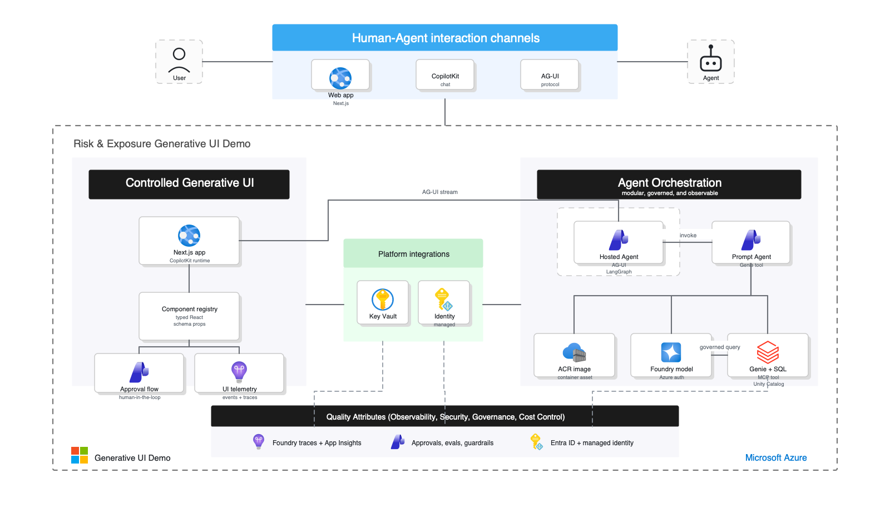
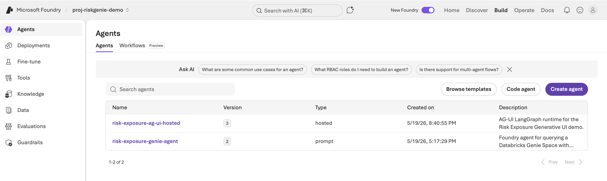
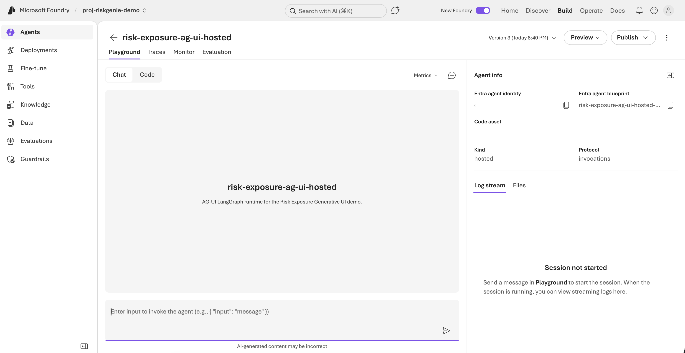
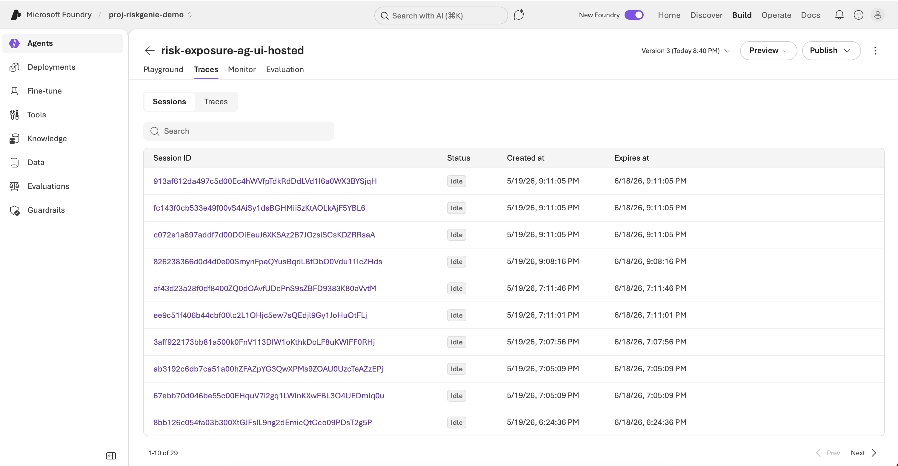
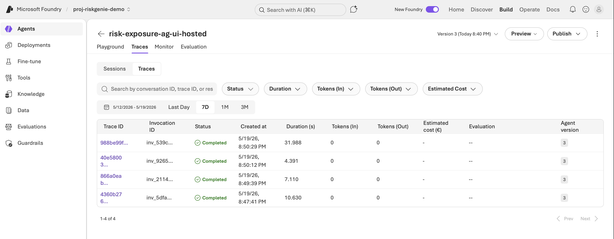
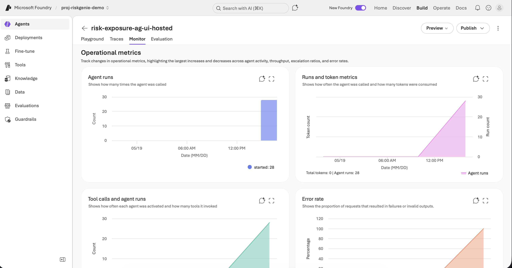
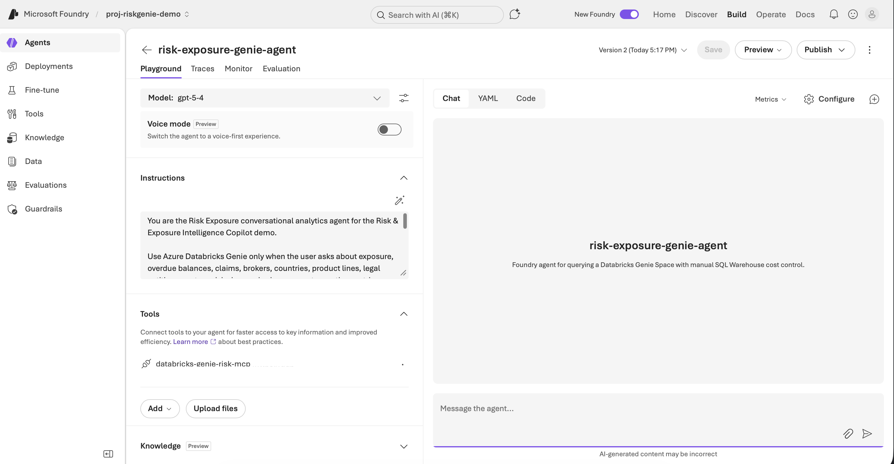
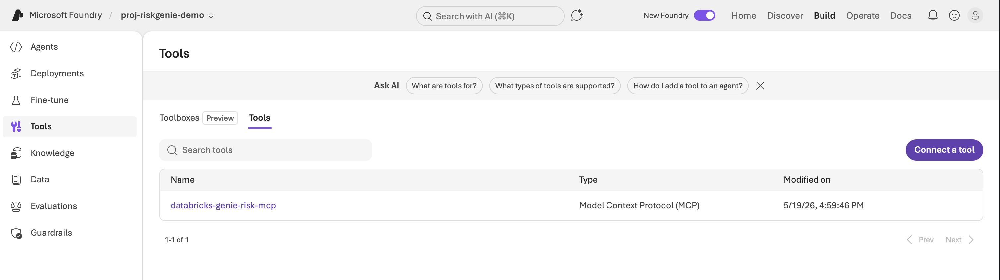
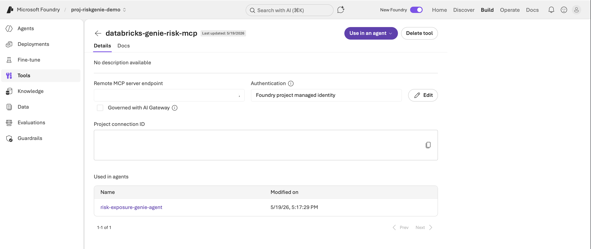
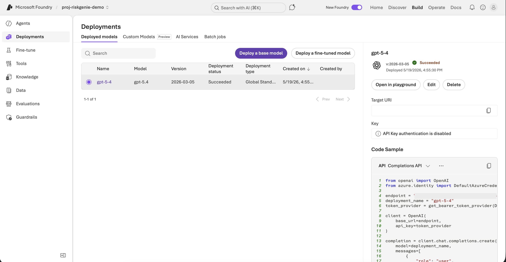

# Risk & Exposure Intelligence Copilot

<p align="center">
  <a href="https://github.com/alexandergg/foundry-genie-generative-ui/actions/workflows/ci.yml"></a>
  <a href="LICENSE"></a>
  <a href="CHANGELOG.md"></a>
  <a href="https://github.com/astral-sh/ruff"></a>
  <a href="https://nextjs.org/"></a>
  <a href="https://www.python.org/"></a>
</p>

<p align="center">
  
</p>

A professional demo repository for **Generative UI on Azure AI Foundry** with **Databricks Genie**, **CopilotKit**, and the **AG-UI protocol**.

The demo shows an Exposure Control Room experience where a user asks business questions, approves or revises governed data access, a Microsoft Foundry agent queries a Databricks Genie Space through MCP, and the web UI renders traceable answers as controlled React components: KPIs, tables, bar charts, line/area trends, donut charts, metric comparisons, provenance footers, and executive risk signals.

## The Generative UI spectrum — three demos

CopilotKit describes Generative UI as a spectrum from developer-controlled components to fully agent-generated interfaces. This repository ships **one runnable demo per band**, all on the same stack (LangGraph agent over the AG-UI protocol, CopilotKit v2 frontend, Azure AI Foundry models), so the only variable is who authors the UI:

| Band | Demo | Frontend / agent | Ports | External dependencies |
| --- | --- | --- | --- | --- |
| **Controlled** | Risk & Exposure Control Room (this page) | `apps/controlled/web` + `apps/controlled/agent` | 3000 / 8123 | Foundry project + Databricks Genie |
| **Declarative (A2UI)** | Risk reports from a custom component catalog — fixed + dynamic schemas | `apps/declarative/web` + `apps/declarative/agent` | 3001 / 8124 | Foundry model endpoint only |
| **Open-Ended** | Sandboxed generated UI + Excalidraw via MCP Apps | `apps/open-ended/web` + `apps/open-ended/agent` | 3002 / 8125 | Foundry model endpoint (+ internet for MCP Apps) |

The flagship demo uses **Controlled Generative UI**, the most predictable band: developers ship a fixed set of pre-built components, the agent chooses which component to render and supplies typed data, and it cannot invent arbitrary markup. The agent also drives the app shell itself — spotlighting a visual or entering presentation mode — through the same controlled tool path. That model fits governed risk analytics: deterministic visual payloads, schema validation in the client, repeatable executive-facing UI.

The two companion demos cover the rest of the spectrum and run standalone with nothing but a Foundry model endpoint:

- **Declarative (A2UI):** the app defines a custom component catalog ([A2UI](https://docs.copilotkit.ai/a2a/generative-ui/declarative-a2ui) — metrics with trends, Recharts bar/pie charts, dashboard cards, tables, badges) and the agent composes against it in both schema styles: **fixed** (pre-authored executive report / brief; deterministic, works with no model at all) and **dynamic** (the LLM assembles the layout itself, rendered progressively as it streams).

  ```bash
  cp apps/declarative/agent/.env.example apps/declarative/agent/.env  # set RISK_MODEL_ENDPOINT
  npm run install:declarative-agent && npm run dev:declarative-agent  # :8124
  npm run dev:declarative-web                                         # :3001
  ```

- **Open-Ended:** no components, no catalog. With `openGenerativeUI` the agent writes sandboxed HTML/CSS/JS rendered live as it streams, and through `mcpApps` it launches full applications (Excalidraw whiteboards) inside the chat. Run the same prompt twice and the variation is the point (and the governance caveat).

  ```bash
  cp apps/open-ended/agent/.env.example apps/open-ended/agent/.env       # set RISK_MODEL_ENDPOINT
  npm run install:open-ended-agent && npm run dev:open-ended-agent       # :8125
  npm run dev:open-ended-web                                       # :3002
  ```

See [docs/generative-ui-spectrum.md](docs/generative-ui-spectrum.md) for the band-by-band mechanics (AG-UI vs A2UI, key files, governance trade-offs) and [docs/session-guide.es.md](docs/session-guide.es.md) for a ready-to-present session script (Spanish). The taxonomy follows CopilotKit's [Generative UI Spectrum](https://www.copilotkit.ai/generative-ui-spectrum); the architecture is also available as an editable diagrams.net file: [docs/generative-ui-architecture.drawio](docs/generative-ui-architecture.drawio).

## Architecture

<p align="center">
  
</p>

The diagram above shows the high-level Azure implementation: a controlled CopilotKit UI calls the hosted AG-UI agent in Microsoft Foundry, which coordinates governed analytics through a Foundry prompt agent and Databricks Genie MCP. Identity, secrets, container image delivery, and telemetry stay in managed Azure services.

```text
Browser
  → Next.js + CopilotKit UI
  → /api/copilotkit
  → CopilotRuntime + AG-UI HttpAgent
  → Local FastAPI AG-UI bridge or Foundry Hosted Agent invocations endpoint
  → LangGraph supervisor + controlled UI mapping
  → Microsoft Foundry Prompt Agent
  → Databricks Genie MCP endpoint
  → Databricks SQL Warehouse + Unity Catalog demo view
  → Application Insights + Foundry Traces for prompt and hosted agent telemetry
```

See [docs/architecture.md](docs/architecture.md) for details.

## Microsoft Foundry implementation

The deployed Foundry project uses a two-agent design:

| Agent | Type | Responsibility |
| --- | --- | --- |
| `risk-exposure-ag-ui-hosted` | Hosted Agent, Invocations protocol | Runs the custom AG-UI/LangGraph runtime, handles session orchestration, controlled UI events, and telemetry. |
| `risk-exposure-genie-agent` | Prompt Agent | Encapsulates governed Databricks Genie access through a Foundry MCP tool and the deployed model. |

This separation keeps the UI orchestration and the governed analytics tool boundary explicit. CopilotKit talks to the AG-UI runtime; the runtime invokes the Genie-backed prompt agent only when business data is needed. Both agents are visible in Foundry with sessions, traces, monitor metrics, and versioned deployment metadata.

<details>
<summary>Foundry portal walkthrough</summary>

| Portal view | What it demonstrates |
| --- | --- |
|  | The project contains the hosted AG-UI runtime agent and the Databricks Genie prompt agent. |
|  | The hosted agent uses the Invocations protocol and a packaged code asset. |
|  | Foundry records hosted-agent sessions for operational inspection. |
|  | Invocation traces capture completion status and latency for the AG-UI runtime. |
|  | Monitor views expose agent runs, tool-call activity, and operational metrics. |
|  | The prompt agent is configured with domain instructions and a Databricks Genie MCP tool. |
|  | The Databricks Genie integration is registered as a Foundry MCP tool. |
|  | The MCP tool is authenticated through Foundry project managed identity and used by the prompt agent. |
|  | The Foundry model deployment is versioned and uses token-based Azure authentication rather than API keys. |

</details>

## Where do I start?

| I want to… | Go to |
| --- | --- |
| Run the three demos locally | [Quick start per band](#the-generative-ui-spectrum--three-demos) above, or each band's README under `apps/` |
| Understand the three Generative UI bands | [docs/generative-ui-spectrum.md](docs/generative-ui-spectrum.md) |
| Deploy the Azure foundation (Foundry + Genie) | [docs/azure-setup.md](docs/azure-setup.md) |
| Deploy all three demos to Azure (webs + hosted agents) | [docs/deploying-the-spectrum.md](docs/deploying-the-spectrum.md) |
| Present this as a technical session | [docs/session-guide.es.md](docs/session-guide.es.md) (Spanish, with prompts and fallbacks) |
| Browse all documentation | [docs/README.md](docs/README.md) |

## Repository layout

```text
apps/
  controlled/          # Band 01 · Controlled — the flagship Genie demo (README inside)
    web/               #   Next.js + CopilotKit + controlled Generative UI components (:3000)
    agent/             #   AG-UI/LangGraph supervisor + Foundry Hosted Agent entrypoint (:8123)
  declarative/         # Band 02 · Declarative — A2UI fixed + dynamic schemas (README inside)
    web/               #   Custom component catalog (definitions + renderers) + chat (:3001)
    agent/             #   Planner + ToolNode fixed layouts + dynamic compose node (:8124)
  open-ended/          # Band 03 · Open-Ended — sandboxed UI + MCP Apps (README inside)
    web/               #   openGenerativeUI + Excalidraw MCP server wiring (:3002)
    agent/             #   One-node graph binding every injected open-ended tool (:8125)
infra/                 # Azure Bicep for Foundry, Key Vault, ACR, monitoring, optional Databricks, and optional frontend App Service
databricks/sql/        # Synthetic Risk Exposure demo dataset and business-facing view
scripts/               # Azure, Databricks, Genie, Foundry, validation, and cost-control scripts
docs/                  # Documentation hub — see docs/README.md for the index
.foundry/              # Local Foundry metadata template; real metadata is gitignored
```

Every band folder pairs one web app with one agent, and every agent ships both entrypoints: `main.py` (local AG-UI bridge) and `hosted_main.py` + `Dockerfile` + `agent.yaml` (Foundry Hosted Agent, Invocations protocol — the same pattern as the deployed Genie agent; build images with `scripts/build-hosted-agent-image.sh <agent-dir>`).

## Getting started

This is a **live Azure demo**, not an offline mock. The frontend can run locally, but useful answers require a deployed Microsoft Foundry prompt agent connected to Databricks Genie. You can then choose whether the custom AG-UI/LangGraph runtime runs locally or as a Foundry Hosted Agent.

1. **Deploy the cloud foundation**
   Follow [docs/azure-setup.md](docs/azure-setup.md) through validation step 9. This creates the Microsoft Foundry project/model, Key Vault, ACR, Application Insights tracing connections, and the Foundry prompt agent. Configure `infra/main.demo.bicepparam` to reuse your existing Databricks Genie workspace or to deploy a new one.

2. **Choose a runtime path**
   - **Recommended demo path:** deploy the AG-UI runtime as a Foundry Hosted Agent, then run only the frontend locally.
   - **Developer path:** run the AG-UI/FastAPI bridge locally; it still calls the deployed Foundry prompt agent and Databricks Genie.

3. **Run or deploy the frontend**
   Follow [docs/local-development.md](docs/local-development.md) to configure `apps/controlled/web/.env.local`, authenticate with Azure CLI, and start the Next.js app. If you want the frontend hosted in Azure too, enable the optional App Service resource in `infra/main.demo.bicepparam` and follow [docs/azure-setup.md](docs/azure-setup.md#11-optional-deploy-the-nextjs-frontend-to-azure-app-service).

4. **Run the live demo**
   Use [docs/demo-script.md](docs/demo-script.md) for a guided session that validates conversational memory, traces, and rich visual components.

## Quick local frontend run

After cloud setup is complete and you have a Foundry Hosted Agent Invocations endpoint:

```bash
npm install
cp apps/controlled/web/.env.example apps/controlled/web/.env.local
```

Set these values in `apps/controlled/web/.env.local`:

```bash
AG_UI_AGENT_URL="https://<hosted-agent-invocations-endpoint>"
AG_UI_AGENT_AUTH="azure-identity"
AG_UI_AGENT_SCOPE="https://ai.azure.com/.default"
```

Then run:

```bash
az login
npm run dev:controlled-web
```

Open <http://localhost:3000>. For the local FastAPI bridge alternative, see [docs/local-development.md](docs/local-development.md#run-with-the-local-ag-ui-bridge).

## Validation

```bash
npm run validate
```

This runs Python Ruff formatting/lint checks, mypy, pytest, and Python compilation for the three agents, plus the lint/test/build pipeline for the three frontends. Per-demo variants exist too (`validate:controlled-agent`, `validate:declarative-agent`, `validate:open-ended-agent`, `validate:controlled-web`, `validate:declarative-web`, `validate:open-ended-web`). See [CONTRIBUTING.md](CONTRIBUTING.md) for pre-commit setup.

## Cost control

The demo is intentionally live: there is no mock runtime. Databricks SQL Warehouse usage can incur cost. Stop compute after each session:

```bash
source .risk.env.local
./scripts/stop-compute.sh
./scripts/validate-risk.sh
```

See [docs/cost-control.md](docs/cost-control.md).

## Official references

- Databricks Genie setup: <https://learn.microsoft.com/azure/databricks/genie/set-up>
- Databricks Genie API: <https://learn.microsoft.com/azure/databricks/genie/conversation-api>
- Microsoft Foundry MCP tools: <https://learn.microsoft.com/azure/foundry/agents/how-to/tools/model-context-protocol>
- Foundry hosted agents quickstart: <https://learn.microsoft.com/azure/foundry/agents/quickstarts/quickstart-hosted-agent>
- Foundry hosted agent runtime components: <https://learn.microsoft.com/azure/ai-foundry/agents/concepts/runtime-components?view=foundry>
- Foundry tracing with Application Insights: <https://learn.microsoft.com/azure/foundry/observability/how-to/trace-agent-setup>
- CopilotKit: <https://docs.copilotkit.ai/>
- AG-UI protocol: <https://docs.ag-ui.com/>
